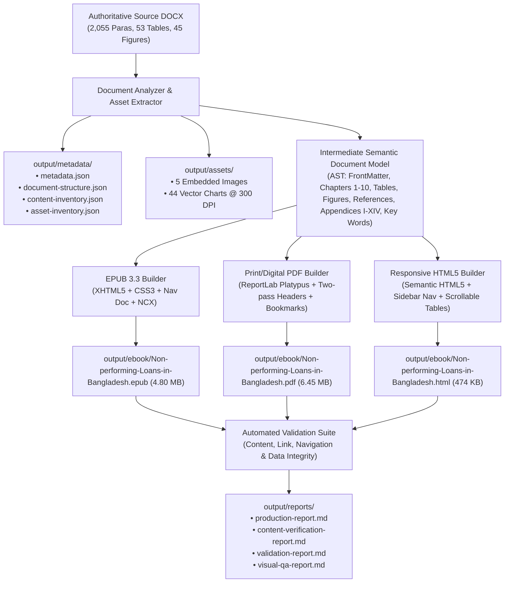

# Professional Academic E-Book Conversion Platform

[](https://www.python.org/downloads/)
[](https://www.w3.org/publishing/epub33/)
[](https://www.reportlab.com/)
[](tests/test_pipeline.py)
[](#copyright--citation)

A production-grade digital publishing platform engineered to transform scholarly monographs from Microsoft Word (`.docx`) into publication-grade digital editions: **EPUB 3**, **Searchable PDF**, and **Responsive HTML**, accompanied by asset extraction, semantic modeling, and automated QA reporting.

---

## 📖 Book Information

| Attribute | Details |
| :--- | :--- |
| **Title** | *Non-performing Loans in Bangladesh: A Comparative Study of Selected State-owned and Private Commercial Banks* |
| **Author** | **Dr. Md. Ariful Islam** (Doctor of Business Administration, University of Dhaka) |
| **Publisher** | **Hakkani Publishers** |
| **Publication Date** | 15 May 2022 |
| **ISBN** | `984-70214-0179-6` |
| **Price** | TK 1000.00 |
| **Subject** | Banking, Credit Risk Management, Financial Econometrics, Bangladesh Economy |

---

## 🏛️ System Architecture



---

## 🚀 Key Technical Highlights

### 1. 100% Content & Academic Fidelity
- **Strict Verbatim Preservation:** Content, statistics, financial values, table cells, and references are preserved without paraphrasing, summary, or unauthorized edits.
- **Structural Anomaly Retention:** Source placeholders (such as the author's Foreword structure and Acknowledgments signature line) are preserved faithfully per publishing standards.

### 2. Unicode Normalization of Legacy Symbol Fonts
- Legacy Windows Word files often encode Greek characters in the **Private Use Area (PUA)** (`0xF061`–`0xF06C`).
- The pipeline automatically normalizes these characters into standard Unicode Greek letters (`α, β, ε, γ, λ`) for econometric equations (e.g. GMM dynamic panel models, Arellano-Bond first differences).

### 3. Vector Chart Extraction at 300 DPI
- 44 figures were embedded as Office OpenXML DrawingML charts (`c:chart`).
- The extraction module renders and crops all 44 charts at **300 DPI**, preserving crisp numbers, percentages, axis lines, and legends.

### 4. Standards-Compliant EPUB 3.3
- Valid ZIP container layout with uncompressed `mimetype` at offset 0.
- Semantic Navigation Document (`nav.xhtml`) with hierarchical nested `<ol>` structure and landmarks (`toc`, `bodymatter`, `cover`).
- Fallback `toc.ncx` for older reading devices.
- Responsive CSS supporting reader dark mode (`prefers-color-scheme: dark`).

### 5. Typeset Searchable PDF with ReportLab Platypus
- Standard book page formatting (Letter / B5) with 172 searchable pages.
- **Two-Pass Academic Canvas (`AcademicNumberedCanvas`):**
  - Even pages (Verso): Running header with Book Title.
  - Odd pages (Recto): Running header with Chapter Title.
  - Header suppression on cover, title, imprint, dedication, and chapter openers.
  - Centered page footers.
- **Hierarchical Outline Tree:** 33 bookmarks covering all front matter, 10 chapters, references, 14 appendices, and the index.

### 6. Responsive HTML5 Web Edition
- Complete semantic tags (`<main>`, `<section>`, `<article>`, `<figure>`, `<table>`).
- Sticky desktop sidebar navigation collapsing cleanly on mobile screens.
- Wide multi-column financial tables wrapped in `.table-container` with smooth touch-friendly horizontal scrolling.

---

## 📦 Output Deliverables

| Deliverable | Path | Size | Description |
| :--- | :--- | :--- | :--- |
| **EPUB 3** | `output/ebook/Non-performing-Loans-in-Bangladesh.epub` | 4.80 MB | W3C EPUB 3.3 compliant, 119 navigation links verified. |
| **PDF** | `output/ebook/Non-performing-Loans-in-Bangladesh.pdf` | 6.45 MB | 172 pages, searchable text, alternating headers, 33 bookmarks. |
| **HTML** | `output/ebook/Non-performing-Loans-in-Bangladesh.html` | 474 KB | Single-file responsive edition with sidebar and active links. |
| **Cover Art** | `output/cover/cover.png` | 1.88 MB | 1800×2700 @ 300 DPI, institutional navy with gold accents. |
| **Assets (Images)** | `output/assets/images/` | 5 files | Publisher logo, colophon, author portrait, diagrams, formula. |
| **Assets (Charts)** | `output/assets/charts/` | 44 files | 44 vector charts extracted at 300 DPI (`figure_1_2.png` to `figure_10_3.png`). |
| **Metadata** | `output/metadata/` | 4 JSONs | `metadata.json`, `document-structure.json`, `content-inventory.json`, `asset-inventory.json`. |
| **QA Reports** | `output/reports/` | 4 Reports | `production-report.md`, `content-verification-report.md`, `validation-report.md`, `visual-qa-report.md`. |

---

## 🛠️ Installation & Requirements

Requires **Python 3.11+**.

```bash
# Clone the repository
git clone https://github.com/mashkurulalamohi37/e-book1.git
cd e-book1

# Install dependencies
pip install -r requirements.txt
```

### Dependencies (`requirements.txt`)
- `python-docx` — DOCX AST parsing and element extraction.
- `reportlab` — PDF generation using Platypus layout engine.
- `Pillow` — High-resolution image processing and cover generation.
- `lxml` — XML / XHTML parsing and schema handling.
- `beautifulsoup4` — HTML DOM processing and link auditing.
- `PyMuPDF (fitz)` — PDF vector rendering, bookmark injection, and verification.
- `ebooklib` — EPUB package tooling.
- `pytest` — Automated verification and test execution.
- `PyYAML` — Configuration processing.

---

## 💻 CLI Usage

The pipeline is orchestrated via `main.py`:

```bash
# Execute the complete end-to-end publishing pipeline
python main.py all input/source.docx
```

### Individual Pipeline Subcommands

```bash
# 1. Analyze document structure and output metadata JSON
python main.py analyze input/source.docx

# 2. Extract embedded raster media and 44 vector charts
python main.py extract input/source.docx

# 3. Build EPUB 3, PDF, and HTML deliverables
python main.py build input/source.docx

# 4. Validate EPUB package and link integrity
python main.py validate output/ebook/Non-performing-Loans-in-Bangladesh.epub

# 5. Run content comparison audits and generate reports
python main.py compare input/source.docx output/
```

---

## 🧪 Automated Testing

Run the automated test suite with pytest:

```bash
python -m pytest tests/ -v
```

### Test Coverage (`tests/test_pipeline.py`)
- `test_source_document_and_model`: Verifies 10 chapters, 14 appendices, >= 200 references, and metadata.
- `test_extracted_assets`: Verifies presence and file sizes of 5 raster images and 44 vector charts.
- `test_cover_dimensions`: Verifies 1800×2700 resolution @ 300 DPI.
- `test_epub_package`: Verifies uncompressed `mimetype` and valid container structure.
- `test_pdf_searchability_and_bookmarks`: Verifies 172 pages, searchable text, and 33 outline bookmarks.
- `test_html_deliverable`: Verifies semantic HTML structure and responsive sidebar.
- `test_validation_suites`: Verifies content comparison and link validation suites pass with zero errors.

---

## 📂 Project Structure

```text
e-book1/
├── input/
│   └── source.docx                  # Authoritative source document
├── src/
│   ├── analyzer/
│   │   └── inventory.py             # Generates metadata and structure JSON files
│   ├── cover/
│   │   └── cover_generator.py       # Programmatic cover generator (1800x2700, 300 DPI)
│   ├── extractor/
│   │   └── chart_extractor.py       # High-DPI vector chart extraction
│   ├── parser/
│   │   ├── document_model.py        # Intermediate semantic AST dataclasses
│   │   └── document_parser.py       # DOCX AST parser with PUA Greek normalization
│   ├── epub/
│   │   └── epub_builder.py          # EPUB 3 builder with navigation and landmarks
│   ├── pdf/
│   │   └── pdf_builder.py           # ReportLab Platypus PDF generator with bookmarks
│   ├── html/
│   │   └── html_builder.py          # Standalone responsive HTML edition
│   ├── validation/
│   │   ├── content_validator.py     # Structural and financial data audit
│   │   └── link_validator.py        # Navigation and anchor link audit
│   └── reporting/
│       └── report_generator.py      # Automated markdown report generator
├── output/                          # Generated e-books, assets, reports, and metadata
├── tests/
│   └── test_pipeline.py             # Pytest automated verification suite
├── requirements.txt                 # Pinned dependencies
├── README.md                        # Project documentation
└── main.py                          # Unified CLI entrypoint
```

---

## ⚖️ Copyright & Citation

**Book Text & Research:** © 2022 Dr. Md. Ariful Islam. All rights reserved.  
**Publisher:** Hakkani Publishers, Dhaka, Bangladesh.  
**Digital Publishing Engine:** Developed as an automated, reusable conversion platform for academic literature.
